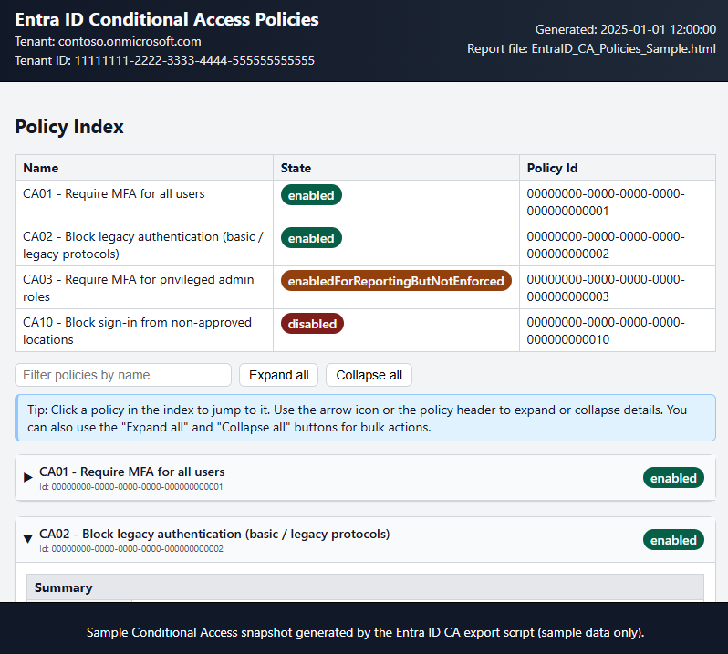

# Entra ID Conditional Access Policies Export

PowerShell script to export Microsoft Entra ID Conditional Access policies to a dynamic HTML report.

The report includes:

- A policy index with name, state and policy Id
- Expand / collapse sections per policy
- Assignments (users, groups, roles)
- Cloud apps & user actions
- Conditions, grant controls and session controls

Useful for audits, SCuBA baseline reviews, and quick CA documentation exports.



## Licensing requirements for Microsoft Entra Conditional Access (P1/P2)

This script only reads and reports your Conditional Access (CA) configuration, but the **CA features themselves** require the right Microsoft Entra ID licenses.

- **Microsoft Entra ID P1 (Premium 1)** – minimum for standard Conditional Access:
  - Core CA policies such as MFA enforcement, device-compliance checks, sign-in location rules, and basic app access controls.
- **Microsoft Entra ID P2 (Premium 2)** – includes everything in P1 plus advanced features:
  - Identity Protection (risk-based policies like blocking risky sign-ins or requiring MFA for risky users)
  - Privileged Identity Management (PIM) and other high-privilege governance features.

These licenses can be obtained either **as standalone Entra ID P1/P2** or as part of bundles such as:

- **Microsoft 365 Business Premium** – includes Entra ID P1 capabilities.
- **Microsoft 365 E3** – includes Entra ID P1.
- **Microsoft Entra (P1/P2) suites** – provide broader identity and security capabilities.

> **Important:** Every user who is *in scope of a Conditional Access policy* should have the appropriate Entra ID license assigned for compliance with Microsoft licensing terms.


## Requirements

- PowerShell 5.1 or 7+
- Microsoft Graph PowerShell SDK with permissions to read CA policies (for example `Policy.Read.All`)

## Install Graph (once per machine/profile):

```powershell
Install-Module Microsoft.Graph -Scope CurrentUser
```

## Usage

1. Open PowerShell in this folder:
```powershell
    cd C:\Dev\Git\EntraID_CA_Policies_Export
```
2. Run the export script:
```powershell
    .\EntraID_CAPolicies_Export.ps1
```
3. Sign in when prompted.

4. The script will create a file in the same folder:

    EntraID_CA_Policies_YYYY-MM-DD_HHMM.html

Open that file in a browser to view the report.

## Files

EntraID_CAPolicies_Export.ps1
Main export script.

- sample-output/EntraID_CA_Policies_Sample.html
  Sample report with fake tenant data, for documentation and screenshots.
- .gitignore
  Ignores transient exports and workspace clutter.
- LICENSE
  MIT licence for this project.
